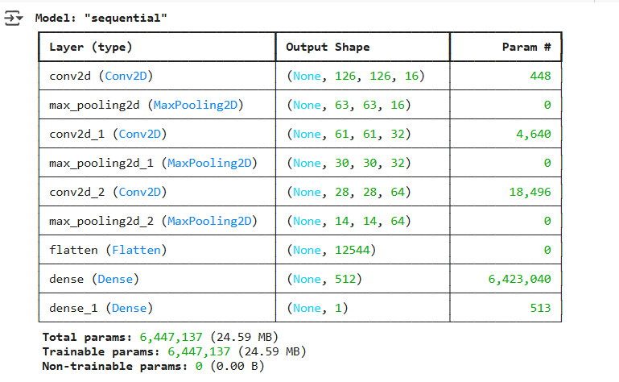

# Cat vs Dog Prediction Telegram Bot

Implemented a convolutional neural network (2 Convo + 2 Dense Layer) trained on catvsdog dataset. Extracted tflite format, and used python-telegram-bot for realtime integration with telegram bot.

---

## 🔍 Project Overview & Demonstration

Simple Cat vs Dog Classification. Whenever user sends a Photo to the telegram, it predicts using trained model and replies back

  

##  Model Architecture

The model is a **Convolutional Neural Network (CNN)** trained from scratch using the [Dogs vs Cats dataset](https://www.microsoft.com/en-us/download/details.aspx?id=54765).  
Frameworks used:
- TensorFlow / Keras
- NumPy, Matplotlib for EDA
- OpenCV for preprocessing

  

